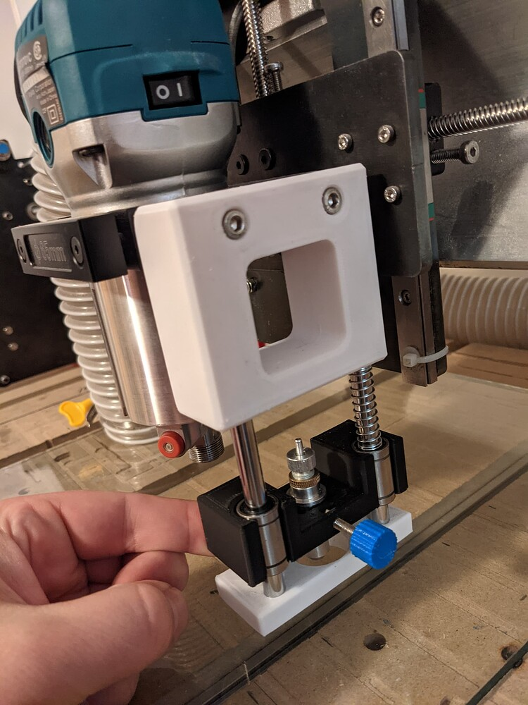

## Drag knife/pen mount

- This uses three 3d printed parts (the top, base, and moving centre piece)
- All the pieces are a "friction fit" (but you could add some adhesive to strengthen it too)
- The centre piece uses 2 LM8UU bearings, 2 8mm rods, and up to 2 springs with inner diameter > 8mm. I found that 1 spring was sufficiently "stiff", especially with some pre-loading
- I bought my bearings, rods, and drag knife off of aliexpress, but you can get them from amazon as well (usually faster, but more expensive)
- The drag knife I am using looks more-or-less like this one: https://www.aliexpress.com/item/32768955648.html

