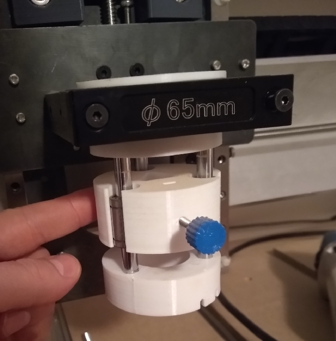

## A spring mount for attaching a pen or pencil to the longmill

This pen mount attaches to the 65mm router mount on the sienci longmill. It uses three LM8UU linear bearings and 8mm rods that are pressfit into the 3d printed mounts. There are two tabs on the bottom bracket that an elastic can be hooked around. This spring mount lets the pen glide smoothly over the drawing surface (which may not be perfectly flat). A set screw holds the pen in place.

In retrospect this is not the best design since the router needs to be removed in order to use the pen mount (and this is tedious given that the router power cable is threaded through the drag chain). At some point I might design a different pen mount that can attach to the side of the router, so it can be used without having to remove it.

