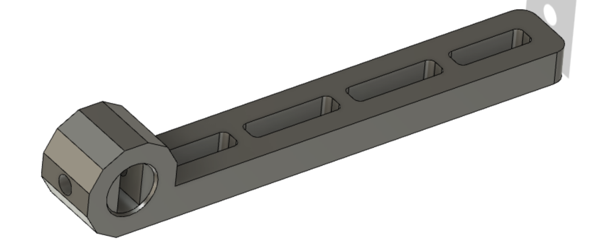
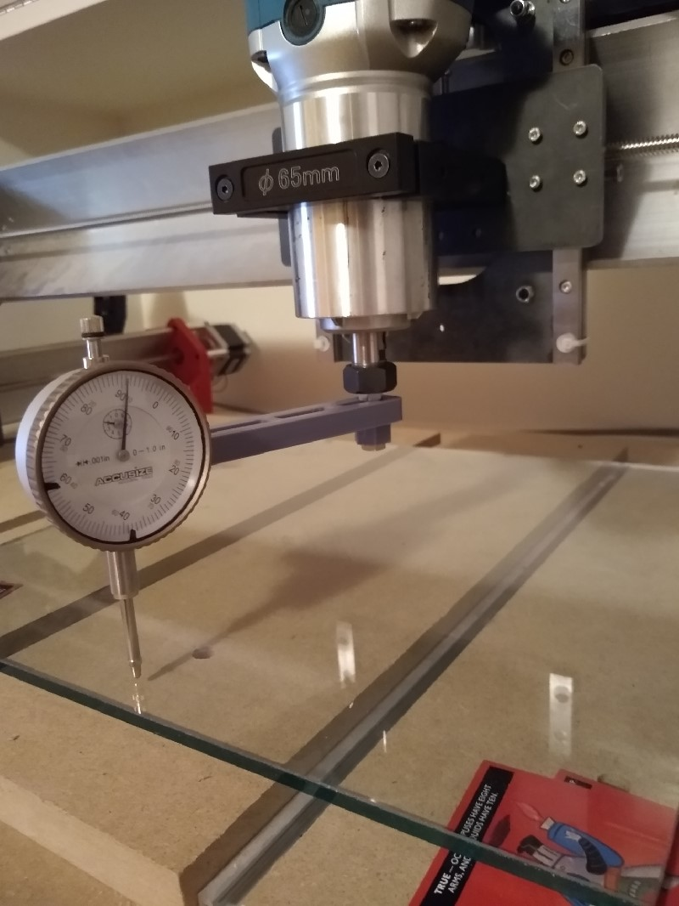

This is a 3d printable jig I designed for tramming my longmill using an 0.001" accusize dial indicator I bought off amazon. It attaches to the back of the indicator and has a slot for a 1/4" bolt. It was quite a tight fit, but it worked well enough for me that I didn't need to adjust the design. Your mileage may vary, and this design is provided for free and as-is.

